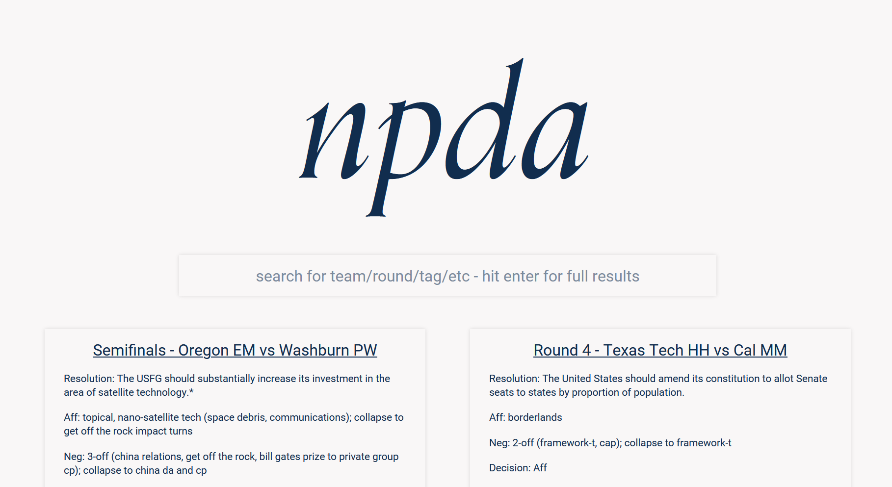

# npda videos

An initiative to collect and store debate videos for current and future NPDA debaters. Development in process - contact Tejas Prabhune at prabhune@berkeley.edu for questions/comments/requests for features!

***

## Current features:

* **Search** - any keyword, team, round, tournament, tag along with typos is currently supported and will return 3 previews while typing and will return up to 10 results when *Enter* is hit.

* **Information** - results are offered in *cards* that provide information about:
    * Round title (w/ teams)
    * Resolution
    * Aff - information about PMC, sometimes MG/PMR
    * Neg - number of off-case positions, block collapse choice
    * Decision
    * Year
    * Tournament
    * Tags

* **Selection** - clicking on a result card will display a main card with the same information and will display an embedded audio controls element if possible and a link to the round as the title of the card itself.

## Planned Features:

The timeline for these features is TBD since the main features I wanted to implement have been completed and school and debate prep usually takes precedence. Pull requests with work on these features are also super welcome!

* **Pagination** - any search query allows the user to page through results rather than being restricted to top 10 results.

* **Upload/Add** - any user may add a result card for a specific round recording they possess by inputting the relevant round information and a Dropbox/Youtube link.

* **Advanced Search Mechanisms** - more explicit keyword-based filtering of results outside of only search-bar inputs.

* **Cross-Sync** - any round recording added to the Cal-specific *List of All Round Recordings* Google Doc will be automatically synced to the website database and vice-versa (potentially Cal-rounds only to prevent doc overloading and crashes).

* **Team/School Based Logins** - Ability to create school-wide accounts for school-specific recordings (e.g. hosting practice round recordings that schools are unwilling to share to the general public)

## Code Structure

The code is currently in a working stage - the main .js file has been commented to a certain extent but is very much vanilla JS as of right now. Hopefully I get around to learning React and reimplementing this project for a more modern structure. Pull requests of this nature are welcome!